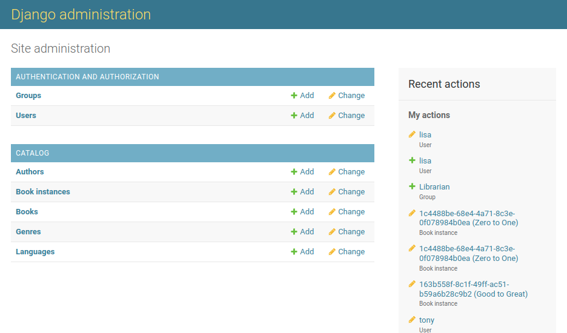
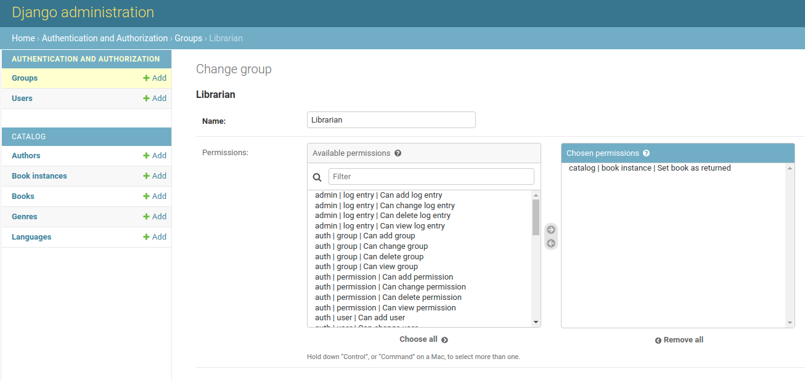

# Lesson 4: Athentication and Authorization

<br>

## 4.1. Session

Sessions are the mechanism of Django (and others) to keep track of "communication state" between the site and a particular browser, which allow to:

- store arbitrary data per browser.
  - actual session data is stored in site database by default, though can be configured in other places (cache, files, ...)
  - Django uses a cookie containing a special *session id* to identify each browser and its associated session data with the site.
- have this data available to the site whenever the browser connects.
  - data items are stored and retrieved via referencing their corresponding "key", like Python dictionary.


<br>

### 4.1.1. Enabling Session

- Session are enabled by default when creating a Django project.
- Change the setup in `INSTALLED_APPS` and `MIDDLEWARE` sections in *'project_root/project_name/setting.py'*

``` python
INSTALLED_APPS = [
    ...
    'django.contrib.sessions',
    ....

MIDDLEWARE = [
    ...
    'django.contrib.sessions.middleware.SessionMiddleware',
    ....
```

<br>

### 4.1.2. Using Session

- **`session` is an attribute of the `request` parameter that is passed to the view**
- `session` is a ditionary-like object that accepts normal Python dictionary operation for querying, adding, modifying and deleting `key:value` pairs in that `session`.

``` python
# Get a session value by its key (e.g. 'my_car'), raising a KeyError if the key is not present
my_car = request.session['my_car']

# Get a session value, setting a default if it is not present ('mini')
my_car = request.session.get('my_car', 'mini')

# Set a session value
request.session['my_car'] = 'mini'

# Delete a session value
del request.session['my_car']
```

- Other helpful APIs supported by **Django Session**
  - test if cookies used by django session is supported by the client browser,
  - set and check cookie expiry date,
  - clear expired session from the data store.
  - etc.


<br>

### 4.1.3. Saving Session

- By default, Django only saves to the session database and sends the session cookie to the client when the session has been *modified* (assigned) or *deleted*.

``` python
# 'my_car' is a new field. This is detected as an update to the session, so session data is saved.
request.session['my_car'] = 'mini'
```

- A change in value of an already exist `key` of session data will not be recognized and saved. You will need to explicitly mark the session as having been modified.

``` python
# 'my_car' is an already exist field. Session object not directly modified, only data within the session. Session changes not saved!
request.session['my_car']['wheels'] = 'alloy'

# Set session as modified to force data updates/cookie to be saved.
request.session.modified = True
```

<br>

## 4.2. Authentication

- Authentication & Authorization built on top of Session, allowing to verify user credentials and define what actions each user is allowed to perform. 
- The framework is provided in the package `django.contrib.auth` and `django.contrib.contenttypes`, including:
  - built-in models `Users` and `Groups`,
  - permissions/flags that designate whether a user may perform a task,
  - forms and views for logging in users,
  - view tools for restricting content.


<br>

### 4.2.1. Enabling Authentication

- Authentication are enabled by default when creating a Django project.
- Change the setup in `INSTALLED_APPS` and `MIDDLEWARE` sections in *'project_root/project_name/setting.py'*

``` python
INSTALLED_APPS = [
    ...
    'django.contrib.auth',  #Core authentication framework and its default models.
    'django.contrib.contenttypes',  #Django content type system (allows permissions to be associated with models).
    ....

MIDDLEWARE = [
    ...
    'django.contrib.sessions.middleware.SessionMiddleware',  #Manages sessions across requests
    ...
    'django.contrib.auth.middleware.AuthenticationMiddleware',  #Associates users with requests using sessions.
    ....
```

<br>

### 4.2.2. Creating users and groups

<br>

**Method 1**: Create users and groups using admin site




<br>

**Method 2**: Create users and groups prgrammatically

``` python
from django.contrib.auth.models import User

# Create user and save to the database
user = User.objects.create_user('myusername', 'myemail@crazymail.com', 'mypassword')

# Update fields and then save again
user.first_name = 'John'
user.last_name = 'Citizen'
user.save()
```


<br>

### 4.2.3. Setting up authentication views

<br>

### 4.2.3. Testing against authenticated users

<br>

**Testing in templates**

- get information about the currently logged in user in templates with the `{{ user }}` template variable.
- test against user with `{{ user.is_authenticated }}` to see if it is eligible to see specific content. For example,

``` html
 <ul class="sidebar-nav">

    ...

   
     <li>User: {{ user.get_username }}</li>
     <li><a href="?next={{request.path}}">Logout</a></li>
   
     <li><a href="?next={{request.path}}">Login</a></li>
   
  </ul>
```

<br>

**Testing in views**

- Function-based view: use `@login_required` decorator
  - If the user is logged in then your view code will execute as normal,
  - If not,  this will redirect to the login URL defined in the project settings (`settings.LOGIN_URL`), passing the current absolute path as the next URL parameter.

``` python
from django.contrib.auth.decorators import login_required

@login_required
def my_view(request):
    ...
```

- Class-based view: inherit `LoginRequiredMixin` in view class
  - can define redirect url for un-authenticated user right in the class with `login_url`.
  - can define redirect url after authenticating right in the class with `redirect_field_name` (equipvalent to `next` in html ).

``` python
from django.contrib.auth.mixins import LoginRequiredMixin

class MyView(LoginRequiredMixin, View):
    login_url = '/login/'
    redirect_field_name = 'redirect_to'
```


<br>

## 4.3. Authorization (Permission)


<br>

### 4.3.1. Define permission flags in model

- Defining permissions is done on the model "`class Meta`" section, using the `permissions` field

``` python
class BookInstance(models.Model):
    ...
    class Meta:
        ...
        permissions = (("can_mark_returned", "Set book as returned"),)
        # "can_mark_returned": permission flag name (for development)
        # "Set book as returned": permission verbose (showed to users)
```
- *Note: re-run migration to apply model change*


<br>

### 4.3.2. Grant permissions to a specific user all group via admin site

<br>




<br>

### 4.3.3. Testing against user permission

<br>

**In Templates**

- The current user's permissions are stored in a template variable called `{{ perms }}`
- check permission with respect to a specific models via `{{ perms.app_name.can_mark_returned }}`

``` html

    <!-- We can mark a BookInstance as returned. -->
    <!-- Perhaps add code to link to a "book return" view here. -->

```

<br>

**In Views**

- Function-based: Using `permission_required` decorator

``` python
from django.contrib.auth.decorators import permission_required

@permission_required('catalog.can_mark_returned')
@permission_required('catalog.can_edit')
def my_view(request):
    ...
```

- Class-based: Using `PermissionRequiredMixin` mixin

``` python
from django.contrib.auth.mixins import PermissionRequiredMixin

class MyView(PermissionRequiredMixin, View):
    permission_required = 'catalog.can_mark_returned'
    # Or multiple permissions
    permission_required = ('catalog.can_mark_returned', 'catalog.can_edit')
    # Note that 'catalog.can_edit' is just an example
    # the catalog application doesn't have such permission!
```


- *Note: for logged-in users with permission violation*
  - *`@permission_required` redirects to login screen (HTTP Status 302).*
  - *`PermissionRequiredMixin` returns 403 (HTTP Status Forbidden).*