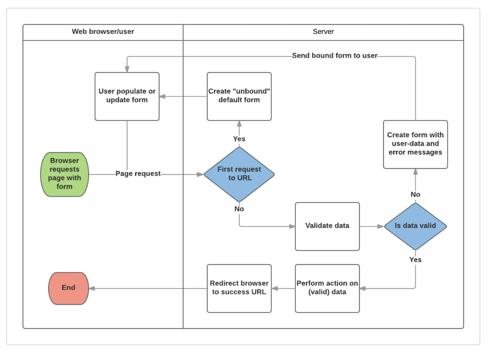

# Lesson 5: Django Form

<br>

## 5.1. Form handling process

<br>



- **S1: Display default form for the first time requested**
  - fields might be blank or populated with initial value.
  - form is called unbound in this stage since their is no user associated data.

- **S2: Receive data from submit request and bind it with the form**
  - assign user entered data to form fields

- **S3: Clean and validate data**
  - performs sanitization of the input and converts them into consistent Python types.
  - checks if input values are appropiate for the fields.
  - **If data is invalid**: re-display the form with previously user populated values and error messages for the problem fields. this is call *bounded form*
  - **If data is valid**: go to **S4**

- **S4: Perform required action**
  - e.g. save the data, send an email, return the result of a search, upload a file, etc.

- **S5: Redirect user to a specified page when the entire process is completed**

<br>

## 5.2. Form implementation work flow (Function-based view)


<br>

### 5.2.1. Define the `Form`

- defined in a separeate Python file at *'app_name/forms.py'*
- package `forms`
- Superclass: `Form`

<br>

**Form fields**

- Types: The same as Model types
- Arguments:
  - `required`
  - `label`
  - `label_suffix`
  - `initial`
  - `widget`
  - `help_text`
  - `error_messages`: a list of error messages for the field.
  - `validators`: a list of functions will be called on the field in place of validation.
  - `localize`
  - `disabled`: disallow user to edit the field if `True`.

``` python
from django import forms

class RenewBookForm(forms.Form):
    renewal_date = forms.DateField(help_text="Enter a date between now and 4 weeks (default 3).")
```

<br>

**Field validation**

- Override the method `clean_<fieldname>()` to implement field validation.
- get field data with `data = self.cleaned_data['<fieldname>']`
- raise validation error by `raise ValidationError( '<error message>' )`
- *Note: always return cleaned `data` at the end of validation function whether or not it is changed*

``` python
renewal_date = forms.DateField(help_text="Enter a date between now and 4 weeks (default 3).")

def clean_renewal_date(self):
    data = self.cleaned_data['renewal_date']

    # Check if a date is not in the past.
    if data < datetime.date.today():
        raise ValidationError(_('Invalid date - renewal in past'))

    # Check if a date is in the allowed range (+4 weeks from today).
    if data > datetime.date.today() + datetime.timedelta(weeks=4):
        raise ValidationError(_('Invalid date - renewal more than 4 weeks ahead'))

    # Remember to always return the cleaned data.
    return data
```

<br>

### 5.2.2. URL mapping

- determine url for pattern for the form
- connect that pattern with the view of the form (defined in *'app_name/views.py'*), via `path()` function in *'app_name/urls.py'*

``` python
urlpatterns += [
    path('book/<uuid:pk>/renew/', views.renew_book_librarian, name='renew-book-librarian'),
]
```

<br>

### 5.2.3. Define view function

<br>

**Detect first time request to show unbounded form**

- form that uses `'POST'` request: test against the `request.method` as `GET` (the first time) or `POST` (data submited).

``` python
if request.method == 'POST':
    # form binding
    form = FormClass(request.POST)

    # form validation
    if form.is_valid():
        # form actions if valid
        # re-direct user after submission success
        HttpResponseRedirect(reverse('<name of url pattern to be redirected to') )
    else:
        # error bounded form rendering if invalid
        # this is done automatically by Django by default.
        
else:
    # un-bounded form rendering
    form = FormClass(initial={'<fieldname>': <field_initial_value>, ...})
    context = {
        'form': form,
        ...
    }
    return render( request, '<form html template path>', context=context)
```

- form that use `'GET'` request: read a hiden value in the form and update it each time receiving a reqest.


<br>

### 5.2.4. Create template file

- **Note**: Add the `` to every Django template you create that uses POST to submit data. This will reduce the chance of forms being hijacked by malicious users.


<br>

## 5.3. Replace Form with ModelForm

- **When**: form fields are derived from the fields of a single model.
- **Why use**: Avoid replicating of fields, since they are already defined in the associated Model.
- **How to use**:
  - Define ModelForm instead of Form class in *'forms.py'*, in which the associated Model is defined in sub-class `Meta` with `model = <Associated Model>`

``` python
from django.forms import ModelForm

from catalog.models import BookInstance

class RenewBookModelForm(ModelForm):
    class Meta:
        model = BookInstance

        # fields to be displayed in the form
        fields = ['due_back']

        # customize field label
        labels = {'due_back': _('New renewal date')}

        # customize field help text
        help_texts = {'due_back': _('Enter a date between now and 4 weeks (default 3).')}
```

- 
  - define validataion function inside ModelForm class:

``` python
class RenewBookModelForm(ModelForm):
    ...
    def clean_<field_name>(self):
        # same function content as Form validation function
```

- 
  - replace Form in view function with ModelForm

<br>

## 5.4. Generic Editing Views