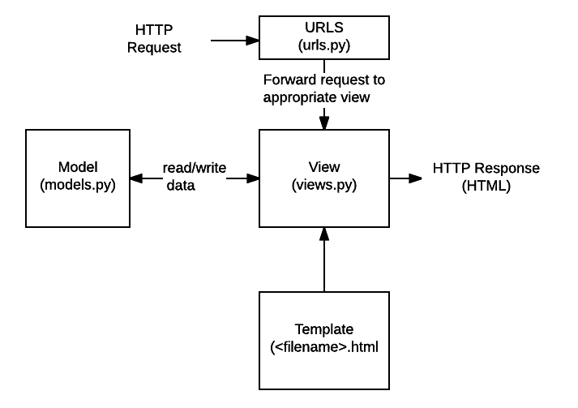

# Lesson 3: Full flow of displaying a webpage

 

## 3.1. Defining resource URL

- **Static URL**: 
  - A fix string
  - 

 

## 3.2. URL mapping

 

## 3.3. View

 

### 3.3.1. Function-based View

 

### 3.3.1. Class-based View

 

## 3.4. Templating